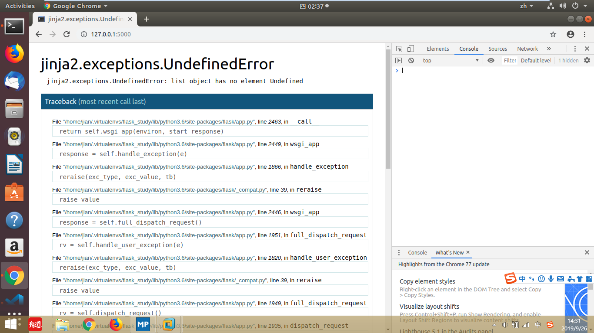

9/26/2019 11:17:13 AM

----------
1. 在用js做图片轮播效果时，用innerHTML修改图片路径时不能传入变量到字符串中
<pre><code>
&lt;script>
    var pics = document.getElementById('pics');
    var n=1 ;
    var str = "";
    console.log(str.replace('n',n))
    setInterval(function(){
        pics.innerHTML = str.replace('n',n);
        n++;
    }, 2000);
&lt;/script>
</code></pre>
报错如下

<font color=red>解决方法</font>
----------
2.HTML中插入视频的方法：```<video src='name.mp4' muted></video>```其中'muted'属性可以让视频静音,引用：var mymovie = document.querySelector('video')


----------
10/24/2019 4:44:26 PM 

1.XPath匹配过程中，如何排除特定的标签

2.scrapy爬取数据时，如何给同字段追加多个值
  转换思路，可以建一个列表，将数据依次存入列表，然后给到相应字段


----------
2019年10月25日16:46:01

Linux下能ping本机ip，不能ping同网关

原因：虚拟机的ip和主机的ip不在同一个网段
解决：将虚拟机的ip设置成与主机在同一网段的ip
<pre><code>
[pxekick@linuxprobe network-scripts]$ cat ifcfg-eno16777728 
# Generated by parse-kickstart
IPV6INIT=yes
IPV6_AUTOCONF=yes
BOOTPROTO=static
DEVICE=eno16777728
ONBOOT=yes
UUID=493e9097-96ac-4725-832e-e17748403065
TYPE=Ethernet
DEFROUTE=yes
PEERROUTE=yes
IPV4_FAILURE_FATAL=no
IPV6_DEFROUTE=yes
IPV6_FAILURE_FATAL=no
NAME="System eno16777728"
DNS1=114.114.114.114
HWADDR=00:0C:29:2C:AC:9E
IPADDR0=192.168.1.100
PREFIX0=24
GATEWAY0=192.168.1.1
IPV6_PEERDNS=yes
IPV6_PEERROUTES=yes
</code></pre>
